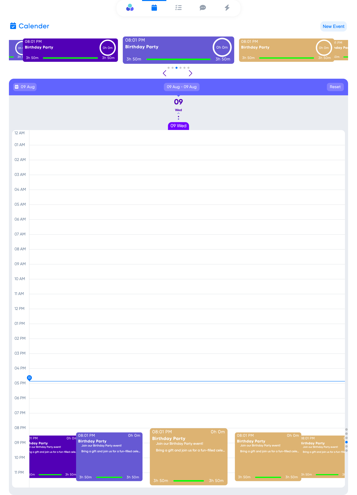

<h1> Daily-Manager | Production Mode </h1>

Daily Manager is a web-based application that combines a calendar, task manager, and charting functionality to help users stay organized and on top of their daily activities. It offers an intuitive interface that makes it easy to view and manage your , add and track tasks, and visualize your progress over time.

<h2>Logo</h2>

<h2>Calender Page</h2>

<section>
			<h2>Technologies Used</h2>
			<ul>
				<li>Reactjs v18</li>
				<li>Socket.io</li>
				<li>Swiperjs</li>
				<li>Date-fns.org</li>
				<li>SCSS, CSS</li>
				<li>REST API</li>
				<li>Node.js</li>
				<li>Express</li>
				<li>MongoDB</li>
				<li>Mongoose</li>
			</ul>
		</section>

<section>
